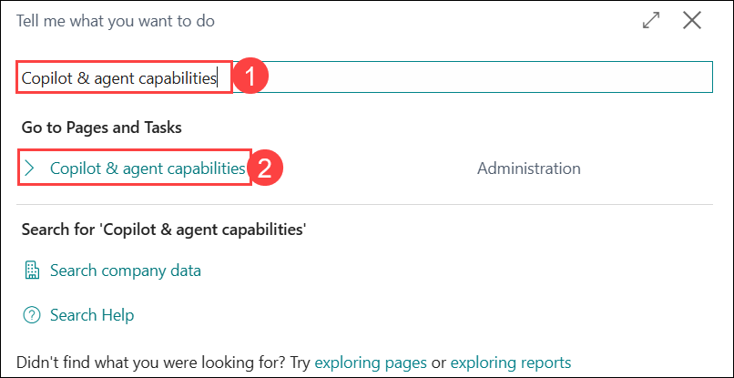
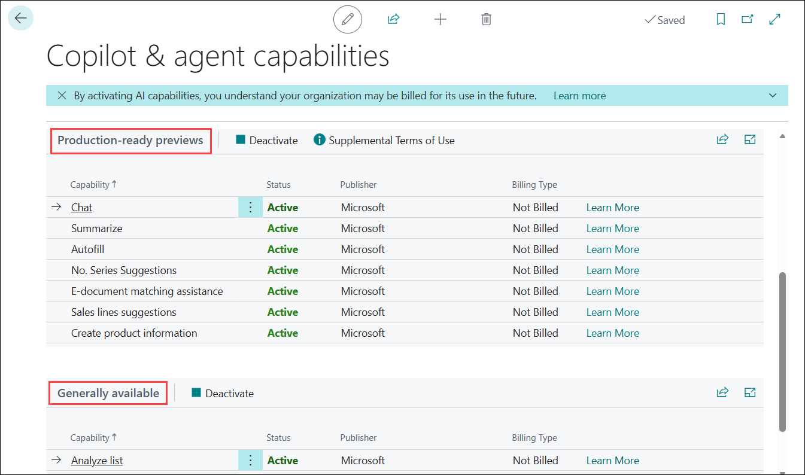
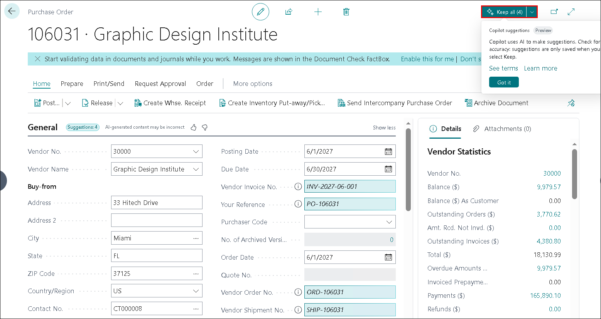

# Lab 1: Accelerate Purchase Order Review with Copilot in Dynamics 365 Business Central

## Introduction

This lab is designed to help you understand how Microsoft Copilot can be used within Dynamics 365 Business Central to improve efficiency in purchasing-related tasks. Throughout this lab, you will work in a Business Central trial environment and explore Copilot features such as data analysis, intelligent autofill, and conversational insights. The lab focuses specifically on accelerating the review and analysis of purchase orders using Copilot capabilities.

By completing this lab, you will gain hands-on experience with Copilot in real business scenarios and understand how AI-driven assistance can support day-to-day purchasing operations.

## Exercise 1: Activate a Business Central Free Trial

In this exercise, you will activate a free trial environment for Dynamics 365 Business Central. This environment will be used for all subsequent exercises in this lab.

1. Open your edge browser and navigate to [Dynamics 365 Business Central](https://www.microsoft.com/en-us/dynamics-365/products/business-central).

1. On the page, locate and click the **Try for free** button. This will initiate the trial activation process.

   

      >**Note:** If you are navigated to a new tab, scroll down and locate **Dynamics 365 Business Central** and select **Try for Free** again.

   

1. You will be navigated to login page, click on **Get started** to finalize the setup process.

      

      >**Note:** If you do not see the **Get Started** option immediately, follow the below steps:

      1. Click on the **Sign in** button to proceed to authentication.

          

      1. If required, enter the administrator password and click on **Sign in** again to confirm your credentials.

         >**Note:** If prompted with optional setup steps, click Skip and go to Business Central to proceed directly to the application.
             
     1. Click on **Get started** to finalize the setup process.

        

1. If a survey page appears, select **Skip survey** to bypass it.

    

1. Once the process is complete, you will be redirected to the **Business Central home page**, confirming that your trial environment has been successfully activated and is ready for use.

    

## Exercise 2: Verify Copilot and Agent Capabilities

In this exercise, you will verify that Copilot and agent capabilities are enabled in your Business Central environment. These capabilities allow Copilot to provide intelligent assistance throughout the application.

1. On the Business Central home page, press **Alt + Q** on your keyboard to open the `Tell me what you want to do` search bar.

2. In the search field, type **Copilot & agent capabilities (1)** and from the search results, select **Copilot & agent capabilities (2)**.

   

3. Review the settings displayed on the page.

4. In most trial environments, agent capabilities are enabled by default. You may review the available options to understand the scope of Copilot features. For the purpose of this lab, **do not activate or deactivate any options**.

   

5. Copilot and agent capabilities are confirmed to be active and available for use in subsequent exercises.

6. Navigate to the business central home page, press the **Alt + Q** button on your keyboard and enter **Contoso Demo Tool (1)** in the field and select **Contoso Demo Tool (2)**.

    

8. Click on the **Generate** button from the top .

    

9. Press **OK** to complete the demo data setup.

    

## Exercise 3: Analyze Purchase Order Data Using Copilot

In this exercise, you will use Copilot to analyze purchase order data directly from a list page. This demonstrates how Copilot can quickly generate insights without manual filtering or calculations.

1. Return to the **Business Central home page**.

2. From the top navigation menu, select **Purchasing (1)** and click **Purchase Orders (2)** to open the list of existing purchase orders. 

    

3. On the Purchase Orders list page, locate and click the **Copilot icon (1)** at the top of the list and from the Copilot menu, select **Analyze list (2)**.

    

4. In the Copilot analysis window, enter the prompt **Show released status entries (1)** and click **Generate (2)** to allow Copilot to analyze the data.

    

5. Observe the generated analysis, which displays purchase orders filtered by released status.

    

6. At the bottom of the analysis window, locate the **Add more details about the analysis** field and type **Sort by amount (1)** and click **Execute (2)**.

    

7. Copilot updates the analysis and sorts the purchase orders based on their values. Click on the **keep it** to save the changes.

    

8. Click the **Copilot icon (1)** again and select **Create new analysis (2)**.

    

9. Click the **prompt guide icon (1)** then select **Add structure (2)**, and choose **Group by (salesperson then country) (3)** to generate the analysis view.

    

1. After the group by statement, write **average amount per vendor name (1)** and click on **Generate (2)** to run the analysis.

    

1. Review the grouped results showing average purchase order amounts per vendor and click **Keep it** to save the analysis for future reference.

    

## Exercise 4: Autofill Purchase Order Fields with Copilot

In this exercise, you will experience how Copilot assists in
automatically filling in fields while creating a purchase order,reducing manual data entry.

**Create a New Purchase Order**

1. Navigate back to the **Business Central home page**.

2. From the top navigation menu, select **Purchasing (1)** and click **Purchase Orders (2)** to open the list of existing purchase orders.

    

3. Click on **Enter Analysis Mode** and then **+ New** to create a new purchase order.

    

    .png)

4. In the **Vendor Name** field, open the dropdown list, select **Graphic Design Institute (1)** and click **Show more (2)** to see more details.

   

5. Move your cursor to the **Your Reference** field and hover over the field and click the **Autofill** option.

    

6. Review the auto-generated values in the purchase order and click Keep all to accept and apply the suggested changes..

    

7. The purchase order fields are intelligently populated with Copilot assistance.

## Exercise 5: Chat with Copilot

In this exercise, you will interact with Copilot using natural language to retrieve insights and navigate business data.

1. Return to the **Business Central home page**.

2. Click the **Copilot icon** located at the top-right of the screen.

    

3. In the Copilot chat window, type the query **Show me the top five high-value purchase orders (1)** and click the **Execute (2)** icon.

    

5. Review the list of purchase orders suggested by Copilot and select the first purchase order from the list to explore further.

    

7. Verify the purchase order details displayed on the screen.

    

8. At the bottom of the Copilot window, click **View prompts (1)**, select **Find (2)**, and choose **Look up purchase invoice [number] (3)**.

    

1. Enter **Vendor number 30000 (1)** after `Look up` and click **Execute (2)**.

    

1. Copilot retrieves and displays information related to vendor and click the vendor link to view complete vendor details.

    

1. Click the vendor link to view complete vendor details.

    

## Conclusion

You have successfully completed this lab. You now understand how Copilot can accelerate purchase order review, analysis, and data entry in Dynamics 365 Business Central, enabling faster and more informed business decisions.
