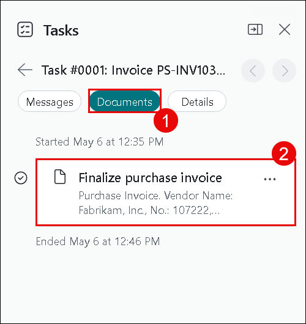

# Lab 2: Vendor Invoice Automation for SMB Finance Teams with Copilot in Dynamics 365 Business Central

# Introduction

In this lab, you will explore how Copilot enhances vendor invoice processing in Dynamics 365 Business Central for small and medium-sized finance teams. The lab walks through configuring the Payables Agent, setting up an email inbox for receiving vendor invoices, and using Copilot to automatically create, review, and post purchase documents. You will also gain hands-on experience reviewing invoice data, making necessary adjustments, and understanding how Copilot assists in reducing manual effort while maintaining control over financial transactions. By the end of this lab, you will have a clear understanding of how invoice automation works end to end within Business Central.

## Task 1: Activate the Payables Agent

1. Navigate to Business Central home page.

2. Navigate to **Payables Agent (1)** from the top menu and click on **Activate** to enable the agent.

   

4. Turn On the **Active (1)** toggle, in the **Mailbox** section and click on the **horizontal ellipsis (⋯) (2)** to configure the receival of the invoices.

   

2. Click **Next** to assign an email account to the agent.

   

3. From the available options, select **Current user (1)**, allowing the agent to use the signed-in user’s mailbox for receiving invoices, then click **Next (2)**.

   

4. Click **Next** again to confirm the mailbox setup.

   

5. Click **Finish** to complete the mailbox configuration.

   

6. Verify that **Current user** appears in the **Email accounts** section and click **OK** to finalize the setup.

   

7. Click the **right-arrow (\>)** icon to access additional configuration options.

   

8. In the **Document processing** section, ensure **Review email** is turned **On** so that the incoming emails can be reviewed before document creation.

9. Click **Update** to save the Payables Agent configuration.

   

1. Accept the terms and conditions by clicking **I accept** to proceed.

   

## Task 2: Send a Vendor Invoice Email

1. Open a new browser tab and navigate to <https://outlook.live.com/mail/>

2. Sign in using a personal email account to simulate a vendor sending an invoice.

   

3. Click on New Mail and add **<inject key="AzureAdUserEmail"></inject>** in the To address.

4. Set the subject as **Invoice** and add the provided email content in the Body section.

    ```
    Dear Team,

    Please find attached the **Fabrikam invoice** for your review and further processing.

    Kindly verify the details and let us know if any clarification or correction is required from our end.

    Thank you for your support.
    ```
5. Attach the **Fabrikam Invoice US D365F** file from the **C:\LabFiles\lab file** folder and send the email to initiate invoice processing.

   

## Task 3: Review the Incoming Invoice in Business Central

1. Return to the **Business Central** portal once the email is sent.

   >**Note:** Refresh the page if required.

2. Notice that the **Payables Agent (1)** automatically detects the incoming email and creates an **e-Document (2)** request. Open the most recent request.

   

3. Click **Review** to validate the email content.

   

4. View PDF to examine the invoice document and click **Continue** to allow Copilot to create a draft purchase document.

   

1. Wait until the Copilot prepares the purchase document draft.

   >**Note:** If the draft is taking longer to load, refresh the page.

2. Once the draft is ready, click **Review** to examine the generated details.

   

3. Scroll down to the **Total Tax** section and update the tax value to **120** and click **Continue** to move forward with the updated draft.

   

4. Allow Copilot to finalize the draft based on the reviewed information.

      

      >**Note:** If the draft is taking longer to load, refresh the page.

6. Select **Documents (1)** from the tab and click on **Finalize Purchase Invoice (2)**.

      

7. Review the finalized document and click **Post** to complete the transaction.

   

8. Confirm the posting by clicking **Yes**.

   

9. Click **Yes** again to view the posted document.

   

## Task 4: Create and update Number Series

1. Navigate to the **Business Central Home** page.

2. Select **Purchasing (1)** from the top menu and open **Purchase Orders (2)** to review the automatically assigned order numbers.

   

   

3. Navigate to the homage page, Press Alt + Q, enter **Purchase & Payable (1)** in the field, and select **Purchases & Payables setup (2)** option.

   

4. Scroll down to the Number Series tab and you can see that **IRS 1096 Form no.** series is not available in the setup. Click on the Back button at the top.

   

5. Press **Alt + Q**, search for **Number Series (1)**, and open the **No Series (2)** page to view how document numbers are generated.

   

6. From the **Number Series** page, click on the **Copilot icon (1)** and selct **Generate (2)** to let Copilot suggest changes.

   

7. Enter the provided prompt **Create a number series for the IRS 1096 Form no. series for the current year (1)** and click **Generate (2)**.

   

8. Click on **Keep it** to save the number series.

   

9. Press Alt + Q and enter **Purchases & payables setup (1)**, then select **Purchases & payables setup (2)** option.

   

1. Scroll down and can see the **IRS 1096** number series is created. Click on the back button from top.

   

1. click on the **Generate** button.

   

1. Enter the prompt **Change the [Sales Order] number to [SORD- 1099] (1)** and click **Generate (2)**.

   

1. Review the suggested changes and click **Keep it** to apply them.

   

   

## Task 5: Prepare Number Series for the Next Year

1. Click **Generate** again to explore additional Copilot capabilities.

   

2. Open the **Prompt guidance (1)** and select **Prepare for next year (2)** and Choose **Prepare number series for the next year (3)** from the menue.

   

3. Click **Generate**.

   

4. Review the generated number series and click **Keep it** to save the changes.

   

## Conclusion

By completing this lab, you have successfully configured the
Payables Agent and used Copilot to automate the processing of vendor invoices received via email. They reviewed incoming documents, validated and adjusted purchase details, finalized and posted invoices, and explored how Copilot can assist in managing number series efficiently.
This lab demonstrates how Copilot helps finance teams streamline accounts payable processes, improve accuracy, and reduce manual intervention while retaining full visibility and control within Dynamics 365 Business Central.
